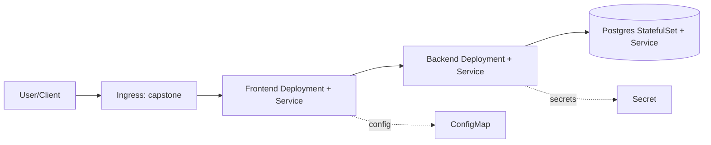

# K8S Zero to Hero

[](LICENSE) [](#) [](#) [](#)

```text
    __ ______ _____    _____                       ______            __  __              
   / //_( __ ) ___/   /__  /  ___  _________      /_  __/___        / / / /__  _________ 
  / ,< / __  \__ \______/ /  / _ \/ ___/ __ \______/ / / __ \______/ /_/ / _ \/ ___/ __ \
 / /| / /_/ /__/ /_____/ /__/  __/ /  / /_/ /_____/ / / /_/ /_____/ __  /  __/ /  / /_/ /
/_/ |_|\____/____/     /____/\___/_/   \____/     /_/  \____/     /_/ /_/\___/_/   \____/ 
                                                                                         
```

**Learn Kubernetes by doing the work.**
Labs, notes, debugging drills, and interview-focused practice in one repo.

No fluff. No locked platform. Just docs, manifests, incidents, and repetition.

---

## Why this repo exists

Kubernetes gets easier once you stop treating it like theory.

This repository is built to help you:

- learn core Kubernetes concepts through guided notes,
- practice real troubleshooting instead of memorizing commands,
- prepare for CKA/CKAD-style workflows,
- build stronger platform, TAM, and security interview instincts.

---

## What you get

- Structured course notes in `docs/`
- Repository map and navigation guide in [`docs/repository-structure.md`](docs/repository-structure.md)
- Progressive hands-on labs in `Labs/`
- Incident-style debugging scenarios
- Cheat sheets and glossary material
- Capstone exercises for platform and security thinking
- Recruiter-facing deliverables hub in `showcase/`

---

## Who this helps immediately

- **Candidates**: turn lab work into interview-ready incident stories with measurable technical signal.
- **Recruiters/Hiring Managers**: review structured proof of troubleshooting ability in 10–15 minutes.
- **Learners**: follow a guided progression from fundamentals to production-style incident handling.

---

## Project goal

Build a production-style Kubernetes simulation that is easy to run and easy to audit.

The repository demonstrates a working **frontend + backend API + database** topology, then layers realistic incident drills, troubleshooting workflow, and recovery validation.

---

## Architecture

### System topology (core)

- **Frontend**: user-facing web tier
- **Backend API**: application logic/service layer
- **Database**: persistent state tier
- **Ingress**: external entry path
- **Config/Secrets**: runtime configuration and sensitive values

Core manifests are available in the capstone app and platform folders:
- `Labs/K8S-Lab-Capstone/02-apps/31-frontend.yaml`
- `Labs/K8S-Lab-Capstone/02-apps/30-backend.yaml`
- `Labs/K8S-Lab-Capstone/02-apps/20-postgres.yaml`
- `Labs/K8S-Lab-Capstone/02-apps/50-ingress.yaml`
- `Labs/K8S-Lab-Capstone/01-platform/00-metrics-server.yaml`



### Kubernetes objects covered

- Deployment
- StatefulSet
- Service
- ConfigMap
- Secret
- Ingress
- NetworkPolicy

---

## Technologies

- Kubernetes (`kubectl`, manifests)
- Ingress NGINX
- metrics-server (resource visibility via `kubectl top`)
- Kubernetes events/log-based diagnostics
- AWS/EKS path (anonymized cloud lab)

---

## Quick Start

### 1) Prerequisites

You should already be comfortable with:

- basic Linux shell usage,
- containers and images,
- basic Kubernetes concepts like Pods, Deployments, and Services.

Recommended local environments:

- [minikube](https://minikube.sigs.k8s.io/docs/start/)
- [kind](https://kind.sigs.k8s.io/)
- Docker Desktop Kubernetes

Recommended CLI tools:

- [`kubectl`](https://kubernetes.io/docs/tasks/tools/)
- [`git`](https://git-scm.com/downloads)
- [`helm`](https://helm.sh/docs/intro/install/) *(recommended)*
- [`jq`](https://jqlang.github.io/jq/) *(helpful)*
- [`yq`](https://mikefarah.gitbook.io/yq/) *(helpful)*
- [`k9s`](https://k9scli.io/) *(optional)*

---

### 2) Start here

If you're new to the repo, begin in this order:

1. [Course Notebook](docs/course-notebook.md)
2. [Kubernetes Glossary](docs/glossary.md)
3. [kubectl Cheat Sheet](docs/kubectl-cheatsheet.md)
4. [Week 1 Labs](Labs/K8S-Lab-Week1/README.md)
5. [Week 2 Labs](Labs/K8S-Lab-Week2/README.md)
6. [Week 3 Labs](Labs/K8S-Lab-Week3/README.md)
7. [Capstone Phase 1](Labs/K8S-Lab-Capstone/docs/phase1/README.md)

---

## How to run (fast path)

1. Deploy the production-style capstone stack from `Labs/K8S-Lab-Capstone/docs/phase1/README.md`.
2. Verify baseline health (pods, services, ingress, PVCs, resource usage).
3. Run failure drills from Week 1 → Week 3 labs.
4. Record each incident using the template in `incident-scenarios/README.md`.

---

## Incident scenarios

A dedicated incident index is available at:
- `incident-scenarios/README.md`

This includes structured scenarios for:
- memory limit failure (`OOMKilled`)
- `ImagePullBackOff`
- service unreachable/selector mismatch
- DNS and NetworkPolicy issues
- crash loops caused by config/secret/probe faults

### Example incident investigation workflow (from this repo)

Use this sequence after deploying the capstone stack and running one of the failure drills:

1. **Capture the symptom quickly**
   - `kubectl get pods -A`
   - `kubectl get events -A --sort-by=.lastTimestamp`
   - `kubectl top pods -A`
2. **Scope impact by tier**
   - Check frontend → backend → database path using manifests in:
     - `Labs/K8S-Lab-Capstone/02-apps/31-frontend.yaml`
     - `Labs/K8S-Lab-Capstone/02-apps/30-backend.yaml`
     - `Labs/K8S-Lab-Capstone/02-apps/20-postgres.yaml`
3. **Investigate the failing workload**
   - `kubectl describe pod <pod> -n <ns>`
   - `kubectl logs <pod> -n <ns> --previous` (if restarted)
   - Confirm common patterns practiced in labs (`OOMKilled`, `ImagePullBackOff`, `CrashLoopBackOff`, selector mismatch).
4. **Validate service routing and policy**
   - `kubectl get svc,endpoints -n <ns>`
   - `kubectl describe networkpolicy -n <ns>`
   - `kubectl exec -it <pod> -n <ns> -- nslookup <service>`
5. **Fix the root cause**
   - Update manifest/config/secret/probe/image tag as needed.
   - Re-apply and watch rollout: `kubectl apply -f <file>` + `kubectl rollout status deploy/<name> -n <ns>`.
6. **Prove recovery**
   - Re-run health checks (`get`, `top`, logs, endpoint checks).
   - Confirm user path through ingress.
7. **Document the incident**
   - Record timeline, commands, evidence, root cause, and prevention steps in `incident-scenarios/README.md`.

This mirrors the repo's Week 1 → Week 3 progression: detect fast, isolate by layer, fix precisely, and document for interview-ready evidence.

---

## Observability baseline

Current in-repo baseline:
- `metrics-server` in capstone platform setup
- `kubectl top` usage for CPU/memory validation

Recommended extension:
- metrics-server + command-level resource and event visibility

---

## Cloud extension (optional)

For cloud-level validation, see the anonymized EKS lab:
- `docs/eks-anonymized-interview-lab.md`

It demonstrates EKS + Load Balancer + IAM-focused troubleshooting and security reasoning.

---

## Recommended workflow

Use the repo like this:

1. Read one topic from `docs/`
2. Run the matching lab from `Labs/`
3. Break something on purpose
4. Prove what failed with commands and output
5. Fix it
6. Repeat until you can explain the failure from memory

That is where the real learning happens.

---

## Repository layout

For the complete structure reference, see [`docs/repository-structure.md`](docs/repository-structure.md).

```text
.
├── .github/
├── docs/
├── exercises/
├── LabPack/
├── Labs/
├── manifests/
│   └── templates/
├── scripts/
├── incident-scenarios/
└── showcase/
```

---

## Learning paths

### Foundations

- [Course Notebook](docs/course-notebook.md)
- [Kubernetes Glossary](docs/glossary.md)
- [kubectl Command Cheat Sheet](docs/kubectl-cheatsheet.md)
- [Observability Baseline (Current Repository Scope)](docs/observability-baseline.md)

### Hands-on labs

- [Week 1: Core Operations and Failure Handling](Labs/K8S-Lab-Week1/README.md)
- [Week 2: Networking and Deployment Incidents](Labs/K8S-Lab-Week2/README.md)
- [Week 3: Advanced Production Thinking](Labs/K8S-Lab-Week3/README.md)
- [Capstone Phase 1: Platform, Security, and Verification](Labs/K8S-Lab-Capstone/docs/phase1/README.md)

### Interview readiness

- [Interview Readiness Plan](docs/interview-readiness-plan.md)
- [Incident Debugging Playbook](docs/incident-debugging-playbook.md)
- [Learning + Recruiter Showcase Guide](docs/learning-and-recruiter-showcase-guide.md)
- [Production Troubleshooting Track](docs/production-troubleshooting-track.md)
- [Incident Investigation Mini Project](docs/incident-investigation-mini-project.md)
- [EKS Three-Tier Security Lab (Anonymized)](docs/eks-anonymized-interview-lab.md)

### Recruiter showcase

- [Showcase Hub](showcase/README.md)
- [Recruiter Quick View](showcase/recruiter-quick-view.md)
- [Portfolio Deliverables (Completed Work)](showcase/portfolio/README.md)
- [Labs Deliverables Index](showcase/labs-deliverables-index.md)
- [Deliverable Template](showcase/deliverable-template.md)

---

## Security checks before pushing updates

Run these before pushing changes to the public repo:

```bash
bash scripts/security-release-scan.sh
bash scripts/security-history-scan.sh
```

These scans are intended to block accidental publication of:

- `.zip` files,
- Notion export artifacts,
- `.env` files,
- key material,
- generated certificates and kubeconfigs,
- cloud credentials and browser exports,
- local dumps/logs,
- and several high-risk secret patterns.

Public repo safety notes:

- Do not use `git push --mirror` for publication.
- Push only reviewed refs after history cleanup has been completed and verified.
- Do not publish backup tags such as `pre-security-rewrite-*`.

For the initial public-release audit and the current policy, see:

- [Public Course Security Audit](docs/reviews/public-course-security-audit-2026-03-20.md)
- [Security Policy](SECURITY.md)

---

## Contributing

Found a mistake? Want to improve a lab? Want to add a cleaner debugging flow?

Contributions are welcome.

Start here:

- [Contributing Guide](CONTRIBUTING.md)
- [Security Policy](SECURITY.md)

Please keep examples reproducible, prefer declarative manifests, and include failure signals plus the fix.

### Publishing safety checklist for contributors

Before publishing updates, verify:
- no real company/customer names,
- no real account IDs, bucket names, internal hostnames, or private endpoints,
- no secrets, keys, kubeconfigs, `.env` values, or credential artifacts,
- anonymized placeholders are used consistently in docs and examples.

---

## License

MIT. See [LICENSE](LICENSE).
